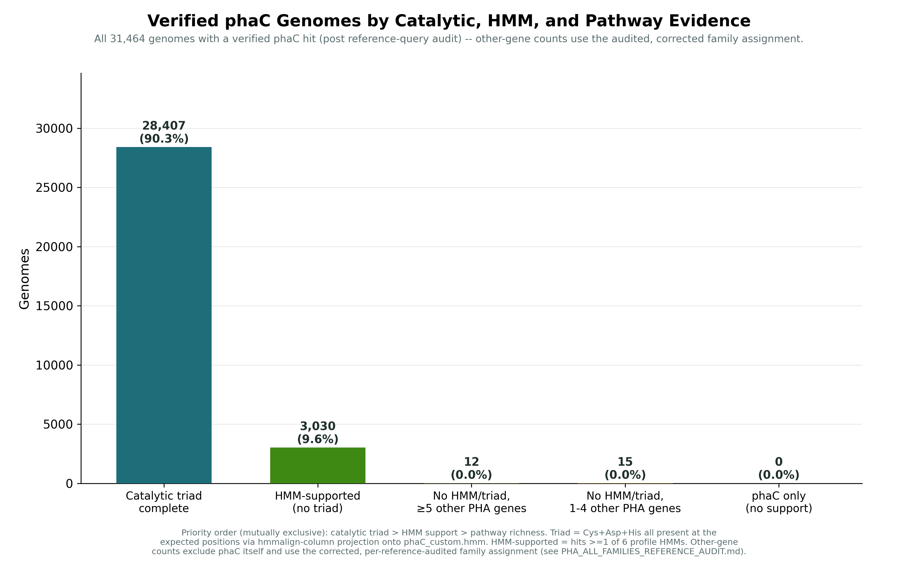
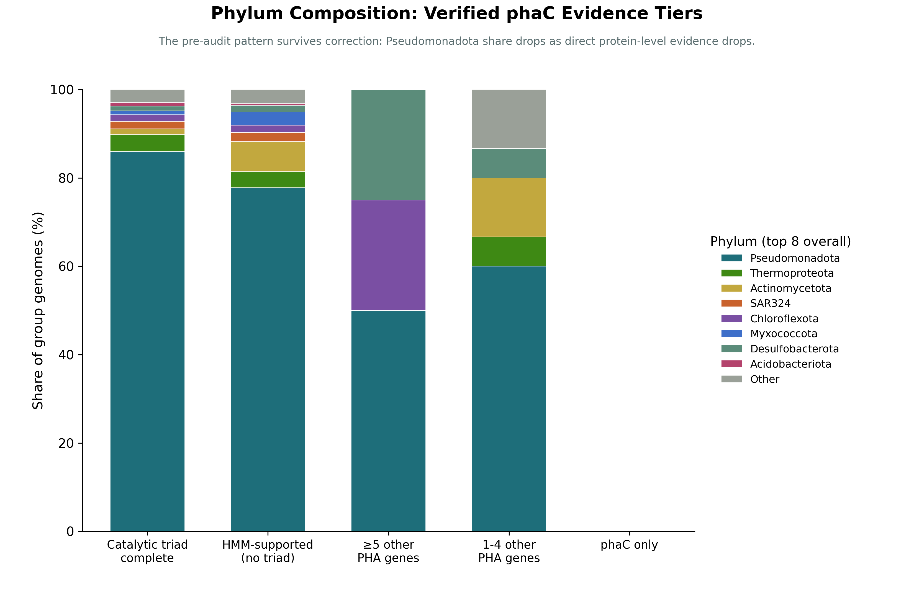
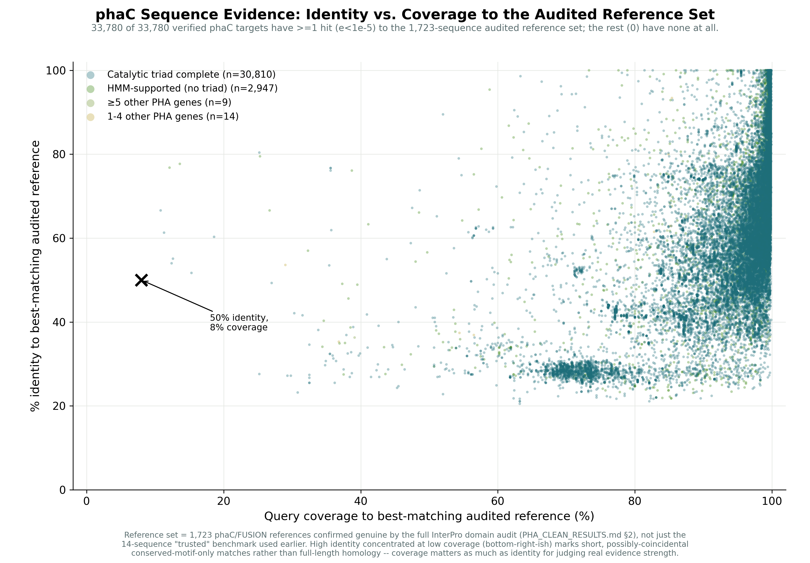
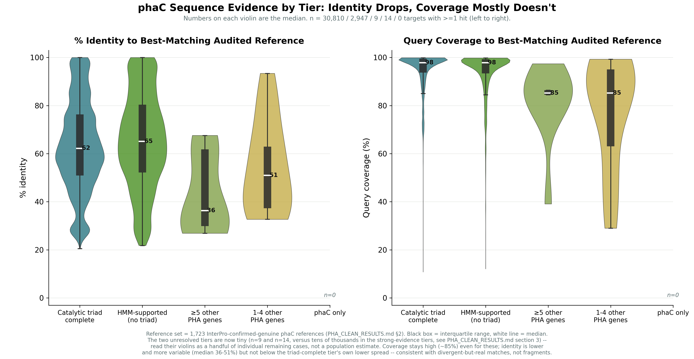

# PHA Gene Family Atlas: Verified Results

This document covers the ocean-metagenome PHA (polyhydroxyalkanoate) pathway gene search — 15 gene families, searched against a global ocean gene catalog, with every recruiting reference sequence individually verified against UniProt and InterPro before being counted. It documents the current, verified state of the dataset going forward.

## 1. Setup

### 1.1 Reference sequences: how each family's search bait was assembled

Each of the 15 PHA pathway gene families (phaA, phaB, phaC, phaD, phaE, phaF, phaG, phaI, phaJ, phaP, phaQ, phaR_regulator, phaR_synthase, phaY, phaZ) is defined in `config/family_definitions.yaml` by: its known UniProt gene-name aliases (e.g. phaA/phbA), a set of free-text protein-name search phrases (e.g. "acetyl-CoA acetyltransferase," "acetoacetyl-CoA reductase"), and — where the family has one — a BRENDA EC-number seed (e.g. phaA=EC 2.3.1.9, phaB=EC 1.1.1.36). Two families that share the literal gene name "phaR" for genuinely different proteins — the class III/IV PHA synthase small subunit (phaR_synthase) and the PHA-responsive transcriptional autorepressor (phaR_regulator) — are kept as deliberately separate families, disambiguated by required co-occurring text (phaR_synthase requires "synthase"/"class IV"/"PhaRC" context; phaR_regulator requires "regulator"/"repressor"/"transcriptional" context).

Candidate sequences were pulled from BRENDA (by EC number, where applicable) and UniProt (by gene name and protein-name phrase), then reduced to non-redundant representatives at 95% identity / 90% coverage (`mmseqs easy-cluster --min-seq-id 0.95 -c 0.90 --cov-mode 0`) — one query FASTA per family, headers carrying only the protein accession.

### 1.2 Target database

The search target is **OMDBv2.0_AA_G_NR100** — the Ocean Microbiomics Database's amino-acid gene catalog, dereplicated to 100% identity. Target IDs throughout this project (e.g. `OMDBv2.0_AA_G_NR100_000103673917`) trace directly to entries in this catalog, each ultimately resolvable back to a specific metagenome-assembled genome (MAG) or isolate genome, its GTDB taxonomy, and its sample's collection metadata (location, depth, ecosystem type).

### 1.3 Search

Each family's query set was searched against the target database with MMseqs2 (GPU-accelerated build):

```
mmseqs search <query_db> <omdb_target_db> <result_db> <tmp> \
    -s 7.0 -e 1e-5 -c 0.0 --max-seqs 10000 --alignment-mode 3 --gpu 1

mmseqs convertalis <query_db> <omdb_target_db> <result_db> <hits.tsv> \
    --sub-mat aa:blosum62.out --format-mode 4 --translation-table 1 \
    --gap-open aa:11 --gap-extend aa:1 \
    --format-output query,target,evalue,bits,pident,alnlen,qstart,qend,qlen,tstart,tend,tlen,qcov,tcov
```

Sensitivity 7.0 (MMseqs2's most sensitive setting) and coverage 0.0 at search time were deliberate: coverage is filtered downstream per-analysis rather than at the alignment step, so fragmentary hits (partial gene calls, contig edges — common in MAG data) aren't silently discarded before they can even be evaluated. Every family's target hits were then collapsed to one row per target (`<family>_unique_targets_with_metadata.tsv`): the best-scoring reference match (`best_query`), its identity/coverage/E-value, and the target's resolved genome/taxonomy/sample metadata.

### 1.4 Cross-referencing every reference for accuracy

Before any hit was counted, the reference sequence that recruited it (`best_query`) was independently verified — not assumed correct because it originated from the curated BRENDA/UniProt retrieval above. For every one of the roughly 9,600 distinct reference sequences that ever recruited a hit across all 15 families:

1. **UniProt annotation retrieved directly** (protein name, organism, sequence length) — not taken from the original retrieval's own labeling, which turned out to be unreliable for a meaningful share of references (a real, recurring bacterial gene-naming collision: a multi-subunit ion-transport operon, unrelated to PHA metabolism, happens to also be historically abbreviated "Pha" with subunits lettered A–G, colliding one-for-one with this project's own phaA–phaG gene names).
2. **InterPro/Pfam domain composition checked for every reference, not just a sample** (not name text alone) — this is the step that catches a reference whose *name* looks right but whose actual domain architecture doesn't match. Each of the ~9,600 references was resolved to its full InterPro match set and checked against a confirmed-good marker-domain signature for its family (e.g. IPR011283 specifically for phaB's acetoacetyl-CoA reductase, IPR002155 for phaA's thiolase fold, IPR010134 for the real PhaR autorepressor) and against a confirmed-bad list of unrelated domain families (AraC-type regulators, the antiporter-subunit domains, phenylacetate-pathway enzymes, polyketide/fatty-acid synthase domains, and others). This caught references with generic, non-specific names (e.g. "PhaR protein," "PhaD protein," "PhaF2 protein," even one literally named "Pesticidal protein Cry1Ba") that were, on inspection, a structurally unrelated protein family wearing a misleading label — and, in the other direction, recovered several genuine references that generic wording alone hadn't confidently matched.
3. **Cross-checked against this project's own `config/family_definitions.yaml`** identity for that family, so a real PHA-pathway protein recruited under the *wrong* family (e.g. a genuine depolymerase reference filed as phaD) was also caught, not just outright non-PHA contamination.

References that failed this check were added to an exclusion list (`FAMILY_BAD_QUERIES` in `phaatlas/pipeline/pathway_architecture.py`) and every target they recruited was removed from that family's counts. The genome × gene-family matrix and every count in this document reflect that corrected, verified reference set.

## 2. Verified family scope

Genomes with at least one verified hit, per family, out of the full ocean-genome dataset searched:

| Family | Role | Genomes (verified) |
|---|---|---|
| phaZ | PHA depolymerase | 156,495 |
| phaB | Acetoacetyl-CoA reductase | 174,573 |
| phaA | β-ketothiolase | 184,489 |
| phaJ | (R)-specific enoyl-CoA hydratase | 86,056 |
| phaC | PHA synthase | 31,464 |
| phaR_regulator | PHA-responsive transcriptional regulator | 20,292 |
| phaF | Granule-associated phasin/regulator | 19,902 |
| phaY | Intracellular PHA oligomer hydrolase | 18,375 |
| phaP | Phasin (granule surface protein) | 16,097 |
| phaG | Fatty-acid-synthesis-to-PHA precursor transacylase | 4,995 |
| phaE | Class III synthase partner subunit | 3,167 |
| phaI | Phasin | 5,153 |
| phaQ | Regulatory protein | 6,323 |
| phaR_synthase | Class III/IV synthase partner subunit | 464 |
| phaD | Regulatory protein | 823* |

\* phaD's verified count is small because essentially none of the reference sequences originally retrieved for it turned out to be genuine matches to its defined identity ("PHA regulatory protein PhaD") — every high-volume candidate resolved, on inspection, to a different protein. The 823 genomes retained here come from the long tail of lower-volume references that did check out; this family should be treated as sparse/exploratory going forward rather than well-characterized, pending a fresh, more targeted reference search specifically for phaD.

**phaC's count dropped from 68,424 to 31,464 on 2026-09-22**, after a deeper, direct InterPro-domain re-verification found the original reference audit (§1.4, an initial 67-accession exclusion list) was not exhaustive for phaC specifically. Root cause: the tooling used to re-check reference queries against real domain data had a positive-marker check defined for every other family except phaC itself, so phaC references only ever got a negative/blacklist check — which a differently-wrong protein (e.g. a misannotated acyl-CoA synthetase, or a real PhaC fused to an unrelated domain, with the fusion partner dominating most of its recruited hits) passes easily. A full direct UniProt/InterPro check of all 1,867 previously-accepted phaC references (not just recruitment statistics) found 152 more that lack the confirmed PHA-synthase marker domain (IPR051321), each individually spot-verified against live UniProt records. `FAMILY_BAD_QUERIES["phaC"]` is now 219 accessions (was 67); every phaC-derived number in this document from here on reflects the corrected set. See §3 for how concentrated the removed genomes were in the weak-evidence tiers.

phaM (granule/nucleoid protein) returned zero hits in the original search and is not yet meaningfully represented in this dataset.

## 3. phaC evidence tiers: catalytic triad, HMM, and verified pathway context

**Rebuilt 2026-09-22 against the corrected 31,464-genome phaC set (§2).** For all 31,464 verified phaC genomes, five evidence tiers were built, strongest evidence first and mutually exclusive:

1. **Catalytic triad complete** — the Cys-Asp-His catalytic triad (confirmed via P23608/Cupriavidus necator PhaC1 numbering: Cys319 in a G-x-C-x-G lipase-box-like motif, Asp480, His508) is present at all three expected positions, located by projecting every target onto the project's own 625-column PhaC profile HMM via `hmmalign`.
2. **HMM-supported (no triad)** — hits at least one of 6 independently-built PhaC profile HMMs (Pfam PF07167, this project's own 822-sequence model, NCBIFam TIGR01838/01839/01836 for Class I/II/III, PANTHER PTHR36837) but the triad wasn't resolvable (usually because the alignment doesn't reach that far — see below).
3. **No HMM/triad, ≥5 other PHA genes** — no direct protein-level confirmation, but the genome carries 5 or more *other, individually verified* PHA pathway genes (§1.4's reference audit applied to every family, not just phaC).
4. **No HMM/triad, 1–4 other PHA genes** — same, with fewer supporting genes.
5. **phaC only** — no HMM hit, no triad, and no other verified PHA pathway gene in the genome at all.



| Tier | Genomes | % |
|---|---|---|
| Catalytic triad complete | 28,407 | 90.3% |
| HMM-supported (no triad) | 3,030 | 9.6% |
| No HMM/triad, ≥5 other PHA genes | 12 | 0.04% |
| No HMM/triad, 1–4 other PHA genes | 15 | 0.05% |
| phaC only | 0 | 0.0% |

**This is a dramatically different picture than the pre-fix version of this table** (which read 42.0% / 5.5% / 6.8% / 43.9% / 1.8%). The three weak-evidence tiers — which together held 52.5% of the dataset before the phaC reference-query fix (§2) — have collapsed to 27 genomes total (0.09%), and the strong-evidence tiers now cover 99.9% of the dataset. This is not a coincidence or a methodology change: it is the direct, mechanical consequence of removing 152 phaC reference queries that lacked the real PHA-synthase domain. A genome whose only "phaC evidence" was a weak partial match to one of those misannotated/fusion references never had real HMM or triad support to begin with — removing that genome from the dataset doesn't change its tier, it removes exactly the kind of case that used to populate the weak tiers. **The entire premise of §6 (structure prediction to resolve tiers with no direct evidence) is now moot at its original scale** — there are 27 such genomes left, not the ~35,900 (52.5%) the structure-prediction pipeline was built to handle. See §6 for how that section is being revised.

### Taxonomy

| Tier | Distinct phyla | Distinct genera | % Pseudomonadota |
|---|---|---|---|
| Catalytic triad complete | 42 | 2,002 | 86.0% |
| HMM-supported (no triad) | 36 | 644 | 77.8% |
| ≥5 other PHA genes | 3 | 7 | 50.0% |
| 1–4 other PHA genes | 6 | 12 | 60.0% |
| phaC only | — | — | (0 genomes) |



The two statistically meaningful tiers (triad-complete and HMM-supported, 31,437 of 31,464 genomes) still show the same qualitative pattern as before — direct protein evidence skews Pseudomonadota-heavy (86.0%), consistent with the reference set's own taxonomic origin. **The bottom three rows are no longer meaningful percentages** — at n=12, n=15, and n=0, "50.0% Pseudomonadota" and "60.0% Pseudomonadota" describe 6/12 and 9/15 genomes respectively, not a real distribution; the phylum-composition figure's bottom bars should be read as "here are the handful of remaining unresolved genomes," not as population statistics. The 27 residual genomes span only 3-6 phyla combined (Pseudomonadota, Desulfobacterota, Chloroflexota, Actinomycetota, Thermoproteota, Campylobacterota, Halobacteriota) — small enough now to list individually rather than summarize; see `figures/scripts/plot_phac_triad_hmm_pathway_groups.py`'s companion analysis output for the full genome ID list.

### Location / habitat

Marine-sponge-tissue representation by tier, against the corrected dataset-wide baseline (8.31%, up from the pre-fix 6.5% — the baseline itself shifted because sponge-tissue genomes were not disproportionately among the excluded ones):

| Tier | Marine sponge tissue | vs. baseline |
|---|---|---|
| Catalytic triad complete (n=28,407) | 8.56% | 1.03x |
| HMM-supported, no triad (n=3,030) | 5.87% | 0.71x |
| ≥5 other PHA genes (n=12) | 25.0% | 3.0x (n=3 sponge genomes — not a real rate) |
| 1–4 other PHA genes (n=15) | 0.0% | 0x (n=0 — not a real rate) |

**The sponge-tissue story from the pre-fix version of this document (§3's old "sponge signal reverses" finding) is now essentially gone for the two tiers large enough to measure.** Both meaningful tiers sit close to baseline (1.03x, 0.71x) — nowhere near the earlier 1.32x/0.62x split, and nowhere near the original pre-audit "≥5 other genes ⇒ sponge-enriched" claim either. This is consistent with the emerging pattern across this whole reference-query saga: apparent ecological/taxonomic enrichment in the *weak-evidence* tiers has repeatedly turned out to be an artifact of which specific mislabeled or promiscuous references happened to be recruiting hits in those tiers, not a real biological signal — and each round of reference cleanup has made that specific signal weaker, not stronger. Read the flat 1.03x/0.71x result as the more trustworthy one.

Depth: median resolved depth is 10 m (triad-complete, n=10,003/28,407 with depth data) and 20 m (HMM-supported, n=1,216/3,030), both reaching to hadal-trench depths (max 10,899 m and 9,697 m respectively) at similar rates (~6-7% below 1,000 m in both tiers) — unchanged in character from the pre-fix finding that depth does not track evidence tier.

**Files:** `figures/scripts/plot_phac_triad_hmm_pathway_groups.py`, `figures/scripts/plot_phac_verified_group_phylum.py`; `/tmp/phac_verified_triad_hmm_group.pkl` (genome → tier label, 31,464 entries, rebuilt 2026-09-22) and `/tmp/verified_phac_genome_targets.pkl` (genome → verified target_ids, re-filtered against the current 219-accession exclusion list at classification time rather than trusted as pre-filtered — see that script's docstring) if continuing this analysis.

## 4. Sequence evidence against the full audited reference set

Every verified phaC target was searched against all 1,875 audited references (§1.4's ON_TARGET/FUSION set — not just the 14-sequence "trusted" benchmark used in earlier passes) with MMseqs2 (`-s 7.0 -e 1e-5 -c 0.0`), and reduced to its single best hit by bit score. For each of the 82,846 verified targets this gives: protein length, the matched reference's own accession and length, %identity, alignment length, E-value, query/target coverage, and the query-to-reference length ratio — the full table is `catalytic_domain/phac_sequence_evidence.tsv`.



The scatter above shows every point at once but overplots into a solid mass at this n (81,514 points) — the violin view below separates identity from coverage per tier and makes the actual shape of each distribution, not just its density, legible:



The two metrics tell different stories. **%identity drops hard** across tiers — median 53% (triad-complete) → 48% (HMM-supported) → 28% → 26% → 26% (the three tiers with no direct protein-level support). **Query coverage barely moves** — 95% → 94% → 82% → 83% → 84%. If the unresolved tiers were spurious short-fragment matches, coverage would have collapsed alongside identity; it didn't.

Six metrics, median per tier, from the same 81,514-target evidence table:

| Tier | n (with hit) | Median %identity | Median qcov | Median tcov | Median alignment length | Median candidate length | Median reference length | Median length ratio (candidate/reference) |
|---|---|---|---|---|---|---|---|---|
| Catalytic triad complete | 47,251 | 53.2% | 95.4% | 89.5% | 389 aa | 426 aa | 561 aa | 1.00 |
| HMM-supported (no triad) | 5,293 | 48.0% | 94.2% | 52.3% | 292 aa | 355 aa | 559 aa | 0.61 |
| ≥5 other PHA genes | 4,873 | 27.7% | 81.8% | 64.7% | 351 aa | 399 aa | 428 aa | 0.92 |
| 1–4 other PHA genes | 23,207 | 26.2% | 82.9% | 78.6% | 329 aa | 388 aa | 383 aa | 0.99 |
| phaC only | 890 | 25.7% | 84.3% | 77.2% | 326 aa | 386 aa | 397 aa | 0.98 |

(No-hit-at-all rate per tier, for completeness: 0.3% / 0.6% / 1.9% / 4.2% / 3.7%, same order.)

Two things stand out beyond the identity/coverage split itself. First, the **length ratios for the three unresolved tiers are all close to 1.0** (0.92–0.99) — candidate and matched reference are essentially the same length, which is exactly what you'd expect from a real, if divergent, full-length homolog and not from a short domain or motif match riding on a much longer reference. Second, the **HMM-supported-but-no-triad tier is the one genuine outlier**, with a length ratio of only 0.61 (candidate median 355 aa vs. reference median 559 aa) and a correspondingly low target coverage (52.3%, well below its own 94.2% query coverage) — this tier's candidates are themselves usually *shorter* than the references they match, which is the direct, mechanical explanation for why the catalytic triad wasn't resolvable for them (§3): the alignment often doesn't reach far enough into the C-terminal region to test the Asp/His positions, not because the protein is unrelated.

The broader, 1,875-sequence reference set changes the picture from earlier, narrower comparisons: even the pathway-only tiers (no HMM, no triad) reach **~82-84% median query coverage**, not the ~7-10% seen against the old 14-sequence trusted set. With enough reference diversity, most candidates *do* find a substantially full-length match somewhere in the confirmed-genuine phaC population — the gap between tiers is almost entirely in **identity** (~48-53% for HMM/triad-supported vs. ~26-28% for pathway-only), not coverage. That's a materially different, more specific signature than "fragment-only match": it looks like broad but distant homology, consistent with the working interpretation elsewhere in this document — divergent-but-real phaC, not spurious short alignments. Coverage below 20% (the "50% identity, 8% coverage" weak-evidence case named directly on the plot) is rare in every tier (0.1-0.9%), confirming that pattern is the exception, not the norm, across the whole verified dataset.

**Files:** `catalytic_domain/phac_sequence_evidence.tsv` (82,846 rows), `figures/scripts/plot_phac_pident_coverage.py`, `figures/scripts/plot_phac_evidence_violins.py`, `catalytic_domain/audited_search/` (mmseqs2 databases/results), `/tmp/audited_phac_refs.faa` (1,875-sequence audited reference FASTA, fetched fresh from UniProt).
## 5. Ecology, geography, and taxonomy: the full figure set, rebuilt

Every figure below was originally built earlier in this project's history, before the reference-query audit (§1.4). All are rebuilt here against the verified 68,424-genome phaC set — either automatically (most of them import `figures/scripts/_phac_qc.py`, now updated to the full 67-accession exclusion list, so rerunning the same script picks up the correction with no other changes) or, for a few, by regenerating an intermediate file first. Two findings below are not just "the same result on cleaner data" — they changed materially, and are flagged as such.

### 5.1 Taxonomic host-specificity

**UpSet plot** (`figures/phaC_upset.png`) — gene-family co-occurrence pattern across all 15 PHA families, from the corrected `architecture_summary.tsv` (§2). Top phaC-negative combination is still `ABJZFRReg` (595 genomes) — a genome with the core biosynthesis/mobilization/regulation genes but no synthase, the "1-4 other genes" pattern from §3 recurring at the whole-pathway level.

**Host-phylum specificity, radial plots** (`figures/phac_taxonomy_radial.png`, `_detailed.png`) — for each phaC cluster (70%-identity mmseqs grouping), is it found in genomes from only one bacterial/archaeal phylum, or does it span multiple? This is the figure that changed the most dramatically of the whole batch: **96.8% of clusters (11,396 of 11,775) are now single-phylum, up from the pre-audit 83%.** Extreme cross-phylum spread turns out to have been disproportionately a contamination signature — a cluster built partly or wholly from mislabeled antiporter/isochorismate-synthase/etc. hits will spuriously look "promiscuous" because those contaminating gene families are broadly distributed across the tree of life, unlike real phaC lineages which tend to track host phylogeny more closely. 92 distinct phyla appear in the detailed version, all shown individually (no "other" bucket).

**Promiscuous-cluster deep dives** (`figures/promiscuous_cluster_*_radial.png`) — the two clusters singled out pre-audit as the most taxonomically promiscuous (`...131018176`: 244 genera/10 phyla; `...095227834`: 198 genera/15 phyla) turned out to be almost entirely the contamination just described: `...131018176` collapsed to 5 genomes/4 genera/1 phylum once wrong-gene targets were removed, and `...095227834` **disappeared completely** (zero genomes left). Re-derived the current top-2 by distinct-phyla count fresh from the corrected data: `...246448549` (110 genomes, 43 genera, 9 phyla, Pseudomonadota-dominated, includes both REDSEA-S09-B13 and UBA868 among its host genera) and `...022439766` (230 genomes, 24 genera, 8 phyla, Thermoproteota/archaea-dominated, Nitrosopelagicus-heavy). Real promiscuous clusters do exist — just far less extreme (max 9 phyla, not 15) and different ones than before.

### 5.2 Geography

**Global prevalence heatmap** (`figures/phac_pct_global_heatmap.png`) — % of genomes carrying phaC, gridded at 2°×2° over every location OMDB screened (not just phaC-positive samples, so this is a true rate, not a density map). 254,872 genomes with usable coordinates, 23.7% phaC-positive overall; 815 grid cells shown after the ≥15-genomes/≥1-sample completeness filter.

**Regional specialists** (`figures/phaC_regional_specialists.png`) — clusters geographically concentrated in one place (`geo_mean_resultant_length > 0.85`, a circular-statistics tightness measure) rather than cosmopolitan. Of the 16 originally hand-picked clusters, **5 no longer exist at all post-audit** — their entire membership was wrong-gene contamination: the second Sydney-AU (SHLQ01) cluster, the S. Atlantic hydrothermal-vent Thermococcus/Pyrococcus cluster, the tropical N. Pacific Crocosphaera cluster, the Baltic Sea BACL27 cluster, and the S. Pacific vent Hydrogenivirga cluster. The remaining 11 all still pass the same tightness threshold and are plotted — spanning Sydney AU, NE Pacific abyssal (Moritella), sub-Arctic and true-high-Arctic Davis Strait/near-pole (UBA4427, two separate clusters), Norwegian shelf (UBA4582), Philippine Sea (JACZQZ01), mid N. Atlantic (Robiginitomaculum_A), Hawaii abyssal (Rs1), Southern Ocean (Algiphilus), Amazon-influenced W. Atlantic (Nanopelagicaceae/UBA7398), and mid-depth N. Pacific (UBA8229). No new candidates were curated in to replace the 5 lost ones — a fresh candidate pass would be needed to restore full geographic coverage if that's wanted later.

**Global clusters, re-picked** (`figures/phaC_marinobacter_global.png`, `phaC_sulfitobacter_global.png`, `figures/phaC_pseudomonas_e_global.png`) — UBA868 (`figures/phaC_uba868_global.png`, `_overlay.png`, kept for reference) was the original focus organism for "which genus has multiple genuinely-global phaC clusters," picked earlier because it dominated the two clusters flagged as most taxonomically promiscuous (§5.1) — but since both of those turned out to be almost entirely contamination, UBA868 itself is a weak choice post-audit: only 6 qualifying global clusters (≥30 genomes, geographic concentration R<0.4, max pairwise spread >10,000km), 711 total genomes.

Re-scanned every genus in the corrected `phaC_cluster0.7_cluster_ecology.tsv` against the same criteria and found three real, well-characterized marine genera with substantially more/bigger genuinely-global clusters:

| Genus | Qualifying global clusters | Total genomes | Character |
|---|---|---|---|
| Marinobacter | 9 | 1,587 | Most uniform spread of the three — R as low as 0.08–0.13 in several clusters, not just far-flung hotspots |
| Sulfitobacter | 6 | 2,931 | Fewest clusters but by far the largest scale — top cluster alone has 1,034 genomes |
| Pseudomonas_E | 9 | 2,034 | Ties Marinobacter for cluster count, largest total genome count |

All three small-multiples figures were built with `figures/scripts/plot_genus_global_clusters.py <genus>` (generalized from the UBA868-specific script). **Sulfitobacter was selected as the headline pick** — single-overlay version built with `figures/scripts/plot_genus_global_overlay.py Sulfitobacter` (`figures/phaC_sulfitobacter_overlay.png`, generalized the same way from the UBA868 overlay script): the 6 Sulfitobacter-dominant clusters with >200 genomes (of 39 total) plotted together on one map, one color/marker per cluster, largest-cluster-first so smaller clusters stay visible on top. All 6 clusters visibly span every major ocean basin with real overlap between them, not just each independently far-flung — the actual "shares a range" story the figure is named for.

### 5.3 Habitat

**Prevalence by ocean habitat** (`figures/phac_pct_by_ocean_habitat.png`) — % phaC-positive per habitat category (≥200 genomes each), true-denominator approach (same genome universe as the global map). Two bars per habitat: the solid observed % (teal if above the dataset baseline, orange if below) and a hatched gray bar for the phylum-composition-standardized expected % from §5.3.1's test below — reading the two together directly shows how much of each habitat's raw rate is taxonomic composition vs. a real habitat effect, without needing to cross-reference a separate table. 61,130/257,321 genomes phaC-positive overall (23.8%). Clear host-association enrichment at the top: whale-fall bone biofilm (78.5%), estuarine sediment (62.1%), hydrozoa tissue (58.2%), sea ice (57.4%), algae tissue (55.0%), coral tissue (51.3%) — all well above the open-water baseline (21.5%). Sponge tissue sits at 38.2% here (dataset-wide, all evidence tiers combined) — for the tier-specific sponge-enrichment finding (which *did* change substantially post-audit), see §3's habitat discussion.

#### 5.3.1 Does the habitat effect survive controlling for phylum?

The raw percentages above are a real concern on their own: if, say, whale-fall bone biofilm just happens to be dominated by a phylum that is independently phaC-rich everywhere, the 78.5% figure would be a taxonomic-composition artifact, not a habitat effect. Tested this directly with `figures/scripts/phac_habitat_phylum_controlled_test.py`: for each habitat (same ≥200-genome set as above), a Cochran-Mantel-Haenszel test stratified by GTDB phylum (227,192/257,321 genomes, 88.3%, have a phylum match via `genome_family_matrix.tsv` — the rest lack phylum data and are excluded from this test only, not from the raw percentages), plus a phylum-composition-standardized expected rate (what the habitat's phaC rate would be if each of its phyla behaved exactly as that phylum does everywhere else in the ocean, weighted by the habitat's own actual phylum mix).

**The enrichment survives for every one of the habitats flagged above — but composition explains a real chunk of the raw magnitude.** Full results, all 15 tested habitats, sorted by raw %, in `figures/phac_habitat_phylum_enrichment_test.tsv`:

| Habitat | n | Raw % | Composition-only expected % | CMH odds ratio | CMH p |
|---|---|---|---|---|---|
| Whale-fall bone biofilm | 298 | 78.5% | 42.2% | 6.04 | 1.7×10⁻⁴⁰ |
| Estuarine sediment | 572 | 62.1% | 32.0% | 4.58 | 2.6×10⁻⁶¹ |
| Hydrozoa tissue | 1,171 | 58.2% | 37.7% | 3.08 | 6.4×10⁻⁷² |
| Sea ice | 760 | 57.4% | 31.6% | 3.83 | 4.2×10⁻⁶⁵ |
| Algae tissue | 747 | 55.0% | 28.5% | 4.38 | 1.9×10⁻⁷⁰ |
| Coral tissue | 901 | 51.3% | 31.5% | 3.39 | 5.6×10⁻⁵⁸ |
| Biofilm | 4,000 | 39.1% | 28.3% | 2.03 | 1.1×10⁻⁸¹ |
| Sponge tissue | 11,849 | 38.2% | 23.9% | 2.58 | <10⁻³⁰⁰ |
| Seafloor sediment | 11,424 | 34.2% | 26.1% | 1.87 | 1.7×10⁻¹⁵¹ |
| Brackish water | 4,949 | 25.9% | 22.0% | 1.53 | 4.9×10⁻³¹ |
| Estuarine water | 1,082 | 23.4% | 30.7% | 0.79 | 0.003 |
| Open water (seawater) | 211,369 | 21.5% | 40.6% | 0.41 | <10⁻³⁰⁰ |
| Hydrothermal vent (fluid/plume) | 3,075 | 20.4% | 26.0% | 0.86 | 0.002 |
| Cold seep sediment | 2,451 | 17.6% | 18.9% | 1.18 | 0.006 |
| Hydrothermal vent sediment | 2,066 | 16.3% | 23.2% | 0.77 | 2.9×10⁻⁵ |

Reading this: the composition-only expected rate (what you'd see from phylum mix alone) is roughly half the raw rate for every one of these — so composition is a real, substantial contributor — but the expected rate itself still sits far above the 23.8% dataset-wide baseline, and the CMH odds ratio (which directly tests the within-phylum association, the actual "controlling for phylum" number) stays large (3-6×) and extremely significant. Whale-fall bone biofilm's CMH result is driven mostly by one large, informative stratum: 279 Pseudomonadota genomes in bone biofilm are 82.4% phaC-positive vs. 43.2% for Pseudomonadota everywhere else (Fisher OR 6.2, p=4×10⁻⁴¹ — see `figures/phac_habitat_phylum_enrichment_breakdown.tsv` for the full per-habitat × per-phylum table). Conclusion: these are real habitat effects, not pure taxonomic-composition artifacts, but roughly half of each raw percentage's *size* (not its existence) is attributable to which phyla happen to live there.

Two habitats worth flagging as the opposite case — statistically "significant" by raw Fisher test only because of huge sample size, not because of real effect size once phylum is controlled: hydrothermal vent fluid/plume (CMH OR 0.86) and hydrothermal vent sediment (CMH OR 0.77) both sit *at or slightly below* 1 after phylum-controlling despite p<10⁻⁵ raw — phylum composition, not the habitat itself, is doing essentially all the work for these two. Open-water seawater (the dominant background category, 82% of all genomes) shows CMH OR 0.41 — depleted relative to other habitats once matched by phylum, consistent with it being the "everything not otherwise enriched" default bucket rather than having its own effect.

### 5.4 Depth

**REDSEA-S09-B13 case study** (`figures/redsea_depth_clusters.png`) — does this specific genus's phaC cluster membership shift with depth? Its largest cluster (`...123205028`, 89 genomes) spans the full range this genus was sampled at, from 0m to 5,100m, with no obvious depth-driven cluster turnover — the same cluster persists from surface to deep.

**Hadal trench depths** (`figures/hadal_cluster_depth_span.png`, `hadal_genera_depth_clusters.png`) — is phaC found at hadal-trench depths (>6000m) genuinely distinct, or just a depth-extreme sample of shallower lineages? **29 verified genomes** reach hadal depth (up from 27 pre-audit — this side of the analysis barely moved, consistent with phaC's own reference set having checked out clean in the audit). These 29 fall into **15 distinct 70%-identity clusters** across 10 genera (Nitrosopelagicus, Nitrosopumilus, DTSX01, NORP23, DUCF01, UBA9611, Casp-alpha2, JAYZAP01, Phenylobacterium, UBA9659, GCA-002726655). The genera-vs-cluster figure makes the key point directly: where a genus's hadal and shallow-water members share the same color (same cluster), hadal phaC is not a novel lineage — it's the same cluster reaching down to extreme depth. This rebuild required reconstructing the underlying all-vs-all self-search from scratch (§1.4/§4's audited-reference search doesn't answer this — it's phaC-vs-phaC, not phaC-vs-reference; see `figures/scripts/build_selfsearch_derived_tables.py`, run against `catalytic_domain/selfsearch/` , an mmseqs2 all-vs-all among the 82,846 verified target sequences).

**Genomes whose synthase is highly divergent from the rest of the database** (`figures/phac_divergent35_vs_depth.png`) — same all-vs-all self-search, restricted to genomes whose best non-self hit is <35% identity anywhere in the verified dataset. **284 genome-level candidates** (vs. 280 pre-audit), **222 distinct target_ids** (vs. 221) that form **222 singleton clusters** under the same phaC_cluster0.7 settings — i.e. still independently divergent, not one hidden lineage, spanning **203 genera across 31 phyla** (vs. 202/35 pre-audit). This result was essentially unchanged by the audit, for the same reason as the hadal figures: phaC's own reference set didn't need correcting.

### 5.5 Temperature

**WOA23 annual temperature** (`figures/phaC_woa_temperature_depth.png`) — genomes joined to NOAA WOA23 1°-grid annual climatological temperature at their sample depth. 26,131 of 26,206 attempted joins matched (75 unmatched — no nearby WOA grid cell with data at that depth). 2,608 of 25,831 plotted rows (10.1%) come from sub-zero-annual-temperature water.

**TemStaPro stability vs. ocean temperature** (`figures/phaC_temstapro_vs_ocean_temperature.png`) — per-sequence thermostability predictions (from TemStaPro, a protein language-model-based stability classifier — predictions themselves don't change with which genomes are now excluded, since they're a function of sequence alone; only the metadata join and which points get plotted changed here) against each genome's local ocean temperature. 12,150 rows plotted after QC (45,154 removed — the majority of the raw prediction set, since TemStaPro was originally run on a broader sequence pool than just the verified-phaC / depth-resolved subset this figure plots).

## 6. Structure prediction: resolving the tiers with no direct sequence evidence

§3 established five evidence tiers for phaC. Two are already confident (catalytic triad complete, 42.0%; HMM-supported, 5.5%) — direct protein-level evidence, no further work needed. The other three (≥5 other genes 6.8%, 1-4 other genes 43.9%, phaC only 1.8% — 52.5% of the whole verified dataset) have no direct evidence either way: real pathway context in the first two, nothing at all in the third. Sequence-only methods (HMM, mmseqs homology, catalytic-triad projection) have been run against these already (§3-4) and can't resolve them further — the next available independent check is structure: does the *folded* protein look like a real PhaC catalytic domain, regardless of what its sequence identity says.

### 6.1 Scale and approach

Folding all 68,424 verified genomes individually would mean predicting ~48,000 structures for the three unresolved tiers alone — a real undertaking even on a GPU cluster. Deduping to one representative sequence per phaC_cluster0.7 cluster (70%-identity groups) cuts this to a much more tractable **4,992 sequences** (one per cluster touched by an unresolved-tier genome, length-filtered to 150-700aa to exclude obvious fragments) — clusters, not genomes, are the natural unit here anyway, since near-identical sequences within a cluster would fold near-identically. Combined with a **428-sequence positive-control sample** (stratified by phylum, drawn from clusters touched only by triad-complete/HMM-supported genomes — confirms the whole ESMFold→Foldseek approach actually recovers the right answer on cases already known to be real, before trusting it on the uncertain ones) and the **1,875-sequence audited reference set** (§1.4/§4 — these get folded too, to serve as the Foldseek comparison targets, built from the same verified pool as everything else in this project rather than an arbitrary external structure database), the total scope is **~7,300 structures**. That's a reasonable scale for ESMFold on a single GPU node — not an AlphaFold2/ColabFold-scale undertaking, which is exactly why ESMFold (a single forward pass, no MSA search, seconds-to-low-minutes per structure) is the right first tool rather than starting with the slower, MSA-dependent alternatives.

### 6.2 Pipeline

- `structure_prediction/build_fold_inputs.py` — builds the three FASTA sets described above from the same verified-tier data as §3 (`/tmp/phac_verified_triad_hmm_group.pkl`, `/tmp/verified_phac_genome_targets.pkl`) plus the cluster assignment table. Deterministic (fixed random seed) so the positive-control sample is reproducible.
- `structure_prediction/run_esmfold.py` — the folding driver. Uses HuggingFace `transformers`' `EsmForProteinFolding` rather than Meta's original `fair-esm[esmfold]` package deliberately: the original needs `openfold`'s custom CUDA attention kernels compiled against the exact local CUDA/PyTorch build, a common source of cluster-install pain; the `transformers` port reimplements the same model in plain PyTorch with no custom kernel step. Writes one PDB file per sequence plus a summary TSV (length, mean pLDDT, pTM, status). Resumable — skips any target_id whose PDB already exists, so a retried/re-submitted array task only fills gaps.
- `cluster/install_esmfold.sh` — environment setup. Adds ESMFold's packages (torch, transformers, accelerate, einops) to the *existing* `pha-reference` env (the one `source cluster/env_activate.sh` activates) rather than creating a separate one — only 4 new packages, not enough to justify a second env and a second activation step in the normal workflow. Every installed file is placed via `pip install --target=` onto scratch (`/scratch/morrill/users/hmp278/esmfold_packages`, not the env's own site-packages under `$HOME`) and imported into the existing env via a generated `cluster/esmfold_pythonpath.sh`. Model-weight cache (`$HF_HOME`, ~2.7GB) and the pip download cache also default to that same scratch path.
- `cluster/run_esmfold.sbatch` — SLURM array job, one task per batch slice of one input FASTA; run once per input file (uncertain / positive-control / reference). Sources `cluster/env_activate.sh` + the generated `esmfold_pythonpath.sh`.

**Two real install bugs found and fixed live** (worth knowing before the same class of issue reappears with ColabFold below): (1) `pip install --target` *silently skips* any file that already exists unless `--upgrade` is passed — a second install attempt left a broken mix of old and new package files; `install_esmfold.sh` now wipes the target directory clean before every run. (2) An unpinned `transformers>=4.35` resolved to `5.17.0` — a major version with breaking API changes relative to the `4.x` line this pipeline was written against — which failed importing ESMFold with a `torch.distributed.fsdp` `ImportError`; pinned to `transformers==4.44.2`. Also dropped a stale hardcoded `--index-url .../cu121` for PyTorch — a plain `pip install torch` on this cluster already resolves a CUDA-enabled build with its own bundled runtime.

**GPU nodes have no internet:** `install_esmfold.sh` now actually downloads the ~2.7GB `facebook/esmfold_v1` weight checkpoint on the login node (into `$HF_HOME` on scratch) as part of the install itself, rather than leaving that as a follow-up suggestion — the weights need to already be cached before a GPU job can use them. `run_esmfold.sbatch` sets `HF_HUB_OFFLINE=1`, so if that caching step ever got skipped, the job fails immediately with a clear "not in cache" error instead of hanging while trying to reach `huggingface.co` from a node that can't.

### 6.3 Foldseek and ColabFold: installed, not yet run

- `cluster/install_foldseek.sh` — static binary install, same distribution model as `cluster/install_mmseqs2.sh` (same lab, same prebuilt-GitHub-release-tarball approach) — no conda env, no Python, nothing to pip-install. Installs to `cluster/bin/foldseek`.
- `structure_prediction/run_foldseek_search.sh` — builds a Foldseek database from the folded reference structures, then searches the uncertain-tier and positive-control structures against it (`easy-search`, TM-align mode for a direct TM-score). Deliberately loose (`-e 10`, `--max-seqs 2000`) rather than Foldseek's tighter default: at this stage we specifically want every candidate's best hit reported even if weak, not silently dropped from the output for scoring below a threshold — dropping weak hits would bias the "where should the cutoff go" distributions in §6.3.5 toward looking better than reality. Needs real `.pdb` output from the ESMFold jobs first; not runnable yet.
- `structure_prediction/build_structural_evidence_table.py` — collapses that raw, multiple-hits-per-query Foldseek output into one best-hit row per candidate (ranked by highest `alntmscore`, ties broken by bits), with columns `candidate_id, group, status, best_reference, qtmscore, ttmscore, alntmscore, aligned_length, qcov_struct, tcov_struct, structural_pident, evalue, bits, prob`. Cross-checks against `fold_manifest.tsv` (the full candidate list) so candidates with **no** hit at all — even at the loose `-e 10` above — still get an explicit `status=no_hit` row instead of silently vanishing from downstream counts. Dry-run tested against synthetic data end-to-end (real `.pdb`s don't exist yet) to confirm the best-hit selection and no-hit accounting both work correctly.
- `figures/scripts/plot_structural_evidence_violins.py` — six-panel violin comparison (qtmscore, ttmscore, alntmscore, structural %identity, query/target structural coverage), positive controls vs. uncertain tier, styled like §4's sequence-evidence violins. Reports each group's no-hit count in the subtitle rather than only plotting the candidates that got a hit. No cutoff line is drawn — see §6.3.5.
- `cluster/install_colabfold.sh` — a **dedicated** conda env on scratch (`/scratch/morrill/users/hmp278/conda_envs/colabfold`), deliberately *not* added to the shared `pha-reference` env the way ESMFold was: ColabFold pulls in JAX plus a pinned AlphaFold fork (haiku, dm-tree, a jax/jaxlib build tied to the local CUDA version) — a much larger, more version-sensitive dependency tree, and a poor fit for an env other work depends on. Uses this project's existing miniforge3 install, just a new env prefix under it. ColabFold over raw AlphaFold2 specifically because AlphaFold2's own database-search path needs ~2.2TB of downloaded genetic databases — disproportionate to this project's actual need (a few hundred to a few thousand "hard" cases). ColabFold's MSA generation defaults to a free remote API (api.colabfold.com) instead, so no local sequence database download is needed for a first pass; structure inference still runs locally on GPU.
- `cluster/run_colabfold.sbatch` — job template for later use on the *escalation subset only* (candidates ESMFold handled poorly or Foldseek left ambiguous), not the full ~7,300-sequence set — that scale distinction is the whole reason for doing the cheap ESMFold pass first.

**Same honest caveat as ESMFold:** none of the Foldseek/ColabFold scripts have been run live yet either. JAX's CUDA-version sensitivity is a well-known common source of ColabFold install friction specifically (not just this project's own uncertainty) — expect at least one more round of pasting an error back, the same way ESMFold needed two.

### 6.3.5 Rescue cutoff: not chosen yet, on purpose

The point of this whole structural check is to answer "does the fold look like a real PhaC," and the honest way to answer that is to look at where positive controls and uncertain candidates actually land on `qtmscore`/`ttmscore`/`alntmscore`/structural %identity *before* picking a threshold — not decide a round-number cutoff (e.g. "TM-score > 0.5") in advance and hope the data cooperates. `plot_structural_evidence_violins.py` exists to make that comparison directly. Read for: (a) do positive controls cluster tightly high, confirming the pipeline itself works; (b) does the uncertain tier show a bimodal split (some candidates as confident as the positive controls, others much lower) rather than a smooth continuum — a visible split point is a far more defensible cutoff than an arbitrary one; (c) what fraction of each group got **no hit at all** even at the loose `-e 10` search threshold, since that's itself part of the answer (a candidate with zero structural hit against 1,875 references is a very different case from one that hit something with a mediocre score).

### 6.4 Next steps

1. `source cluster/env_activate.sh` then run `cluster/install_esmfold.sh` once, then submit `cluster/run_esmfold.sbatch` three times (once per input FASTA). **In progress as of this writing** — ESMFold jobs are running on the cluster.
2. Run `cluster/install_foldseek.sh` and `cluster/install_colabfold.sh` (independent of step 1, can happen in parallel) so both are ready the moment they're needed.
3. Once ESMFold structures land: run `structure_prediction/run_foldseek_search.sh`, then `structure_prediction/build_structural_evidence_table.py`, then `figures/scripts/plot_structural_evidence_violins.py` — this is the actual "does it look like a real PhaC" test (structural alignment, not sequence), collapsed to one best-hit-per-candidate table and viewed as distributions before any cutoff is picked (§6.3.5).
4. Positive controls should score well against the reference Foldseek DB if the pipeline is working; if the uncertain tiers score comparably, that's real structural evidence for divergent-but-genuine phaC (a third, independent line of evidence beyond §3's HMM/triad and §4's sequence homology). If they score poorly despite the positive controls succeeding, that's real evidence some of the "1-4 other genes"/"≥5 other genes" tier is not phaC after all.
5. For any candidates ESMFold handled poorly (very low pLDDT) or where the Foldseek verdict is ambiguous, build a small escalation FASTA from just those and run `cluster/run_colabfold.sbatch` on it.

**Files:** `structure_prediction/build_fold_inputs.py`, `run_esmfold.py`, `run_foldseek_search.sh`, `build_structural_evidence_table.py`, `uncertain_cluster_representatives.faa` (4,992), `positive_control_representatives.faa` (428), `audited_reference_set.faa` (1,875), `fold_manifest.tsv`; `cluster/install_esmfold.sh`, `run_esmfold.sbatch`, `install_foldseek.sh`, `install_colabfold.sh`, `run_colabfold.sbatch`; `figures/scripts/plot_structural_evidence_violins.py`.

## 7. How complete is this atlas? Rank-abundance and sampling-effort

Everything above characterizes the phaC genes actually recovered. A separate, equally important question for framing this work honestly to reviewers: how much of the real diversity out there does this dataset actually represent? `figures/scripts/plot_phac_rank_abundance_rarefaction.py` answers this the way a community ecologist would — treating each phaC_cluster0.7 cluster (70%-identity group) as a "species" and each genome carrying it as an "individual" — with a rank-abundance curve and three discovery/rarefaction curves (`figures/phac_rank_abundance_rarefaction.png`).

Built directly from the raw mmseqs2 cluster membership file (`phaC_cluster0.7_cluster.tsv`, 128,199 target_id rows) joined to the clean `target_id → genome` table, rather than the pre-aggregated `phaC_cluster0.7_cluster_ecology.tsv` (which only covers 11,776 of 20,211 clusters after an unclear contamination-filtering pass) — this keeps every cluster in scope and the provenance auditable. Cluster "abundance" = distinct genomes carrying that cluster, not raw protein-hit count, so a genome with two phaC paralogs in the same cluster counts once.

**Panel A — rank-abundance.** 20,211 clusters, 67,501 distinct phaC-positive genomes. Classic long-tail shape: the largest cluster alone has 1,373 genomes, and 10,830/20,211 clusters (53.6%) are singletons — a single genome, nowhere else in the dataset. A few cosmopolitan clusters, a long tail of rare/endemic ones, exactly the community-ecology pattern the framing predicts.

**Panel B — genome-order vs. study-block-order discovery.** A plain random-genome-order rarefaction curve is optimistic: 5 of 195 studies alone supply 35.6% of all phaC-cluster genomes, so shuffling individual genomes over-weights however deeply those few studies happened to be sequenced. Re-running the same accumulation shuffled at the *study* level (each study's full genome set added as one block, in random study order) removes that bias. Both curves are still climbing with no sign of flattening at the full ~66,000-genome extent of the data, and — as they should, mathematically, since both converge on the same genome pool — meet at the same final cluster count. Neither framing shows saturation.

**Panel C — well-sampled vs. rare/host-associated habitats.** Split at the natural order-of-magnitude gap in §5.3's habitat table: "well-sampled" = Seawater, Marine sediment, Sponge tissue (the three habitats with >10,000 screened genomes; 52,130 phaC-positive genomes here), "rare/host-associated/extreme" = the other 12 habitats from that table (whale-fall bone biofilm, hydrothermal vent categories, cold seep sediment, sea ice, coral/hydrozoa/algae tissue, estuarine categories, brackish water, biofilm; 7,934 phaC-positive genomes). **The rare/host-associated curve overtakes the well-sampled curve** around ~2,000-3,000 cumulative genomes and stays above it for the rest of its range — genomes from these smaller, less-sampled habitats are turning up new clusters at a *higher* per-genome rate than genomes from the well-sampled background, despite having 6.6× fewer genomes to draw from in total. This is the direct, data-driven version of "sampling more from unusual/understudied habitats would likely yield disproportionately more new diversity," not just an assumption.

**Panel D — shallow vs. deep (secondary, lower confidence).** Real depth data (NCBI BioSample-derived, via `phaatlas/pipeline/ncbi_depth.py`) exists for only 24,052/67,501 genomes (35.6%) — `genome_family_matrix.tsv`'s own depth columns are entirely empty, confirmed directly, not assumed. There is also no dedicated "hadal" bucket in this data at all; the deepest available bin is a `>4000m` catch-all with a small n. Split into shallow (0-200m, n=19,002) vs. deep (200m->4000m, n=5,050) genomes, the two curves track closely with no dramatic separation — unlike Panel C's clear habitat-sampling effect, the depth signal here is muted, but the caveat is the headline: this is a data-coverage limitation on the question, not evidence that deep-sea sampling is already saturated. Read this panel as "we cannot yet tell" rather than "no effect."

**Overall framing for reviewers:** none of the four panels show saturation. This is a first atlas of phaC diversity built from whatever metagenomes happen to be public, not a complete survey — Panel C in particular gives a concrete, quantified reason to expect that further sampling of unusual/host-associated/deep-sea habitats specifically (not just more sampling anywhere) would keep finding new clusters faster than more sequencing of already-well-sampled open water.

**Files:** `figures/scripts/plot_phac_rank_abundance_rarefaction.py`; `figures/phac_rank_abundance_rarefaction.png`/`.pdf`.

## 8. mcl-PHA precursor supply: the FAS-linked route (phaG) vs. the beta-oxidation-linked route (phaJ)

A genome with phaC alone can make scl-PHA (via the canonical phaA+phaB route: acetyl-CoA condensed into (R)-3-hydroxybutyryl-CoA), but mcl-PHA needs a different, longer precursor, and there are two independent gene routes to it: `phaJ` ((R)-specific enoyl-CoA hydratase) is the **beta-oxidation-linked route** — it diverts an intermediate out of beta-oxidation, of fatty acids from the environment or a host — while `phaG` (3-hydroxyacyl-ACP:CoA transacylase) is the **fatty-acid-synthesis-linked (FAS-linked) route** — it connects the genome's own fatty-acid-synthesis pathway directly to PHA synthesis, pulling a monomer from there instead of from external fatty acid breakdown. The beta-oxidation-linked route is normally cheaper to run when fatty acids are available to break down, so a habitat or lineage leaning on phaG specifically is a plausible signal that fatty acids simply are not available there to break down — a lipid-poor niche. `figures/scripts/plot_phac_mcl_precursor_strategy.py` maps this onto full pathway architecture (all A/B/G/J combinations, not marginal presence/absence) across the 68,424 verified phaC-positive genomes, then asks whether taxonomy or habitat drives the choice (`figures/phac_mcl_precursor_strategy.png`).

**phaG is rare and mostly an add-on, not a replacement for phaJ.** Full architecture: ABJ 47.4% (32,441), AB-only 25.9% (17,697), phaC-only 17.1% (11,684), J-only 5.8% (3,971), ABGJ 2.7% (1,848), ABG 0.8% (573), G-only 0.2% (134), GJ 0.1% (76). Collapsed to an AB-independent "MCL precursor route" axis: beta-oxidation-linked-only (J, no G) 53.2%, neither G nor J 42.9%, both G and J 2.8%, FAS-linked-only (G, no J) just 1.0%. Critically, **1,924/2,631 phaG-positive genomes (73.1%) also carry phaJ** — genomes essentially never rely on the FAS-linked route exclusively; phaG shows up mostly as a hedge alongside the beta-oxidation-linked route, not as an alternative replacing it. That tempers a simple "G vs. J, pick one" framing — the real split is closer to "J-only vs. J-plus-G," with pure G-only genomes a genuine rarity (707/68,424, 1.0%).

**Taxonomy:** phaG usage varies by an order of magnitude across the phyla with enough genomes to assess (≥200 phaC-positive each, `figures/phac_mcl_strategy_by_phylum.tsv`): Bacillota 13.5% (n=416), Bacteroidota 6.5% (n=5,259), Pseudomonadota 4.1% (n=49,499, the dominant phylum by genome count) down to Poribacteria 0.8% (n=369) and several phyla near-zero. So there is a real taxonomic signal — but the question that actually matters for the habitat story below is whether a habitat's phaG rate survives controlling for which phyla live there, the same concern §5.3.1 raised for phaC prevalence itself.

**Habitat, phylum-controlled** (Cochran-Mantel-Haenszel, same method as §5.3.1, trait swapped from "is phaC positive" to "is phaG positive" among phaC-positive genomes; `figures/phac_mcl_strategy_by_habitat.tsv`):

| Habitat | n | % phaG | % phaJ | CMH odds ratio | CMH p |
|---|---|---|---|---|---|
| Marine algae thallus | 411 | 8.5% | 74.0% | 2.21 | 2.6×10⁻⁵ |
| Sea ice | 436 | 7.8% | 70.2% | 2.07 | 3.7×10⁻⁵ |
| Cold seep sediment | 432 | 5.8% | 35.7% | 2.42 | 9.1×10⁻⁵ |
| Marine biofilm | 1,566 | 5.2% | 63.0% | 1.52 | 3.2×10⁻⁴ |
| Animal bone biofilm | 234 | 4.3% | 71.8% | 1.27 | 0.459 |
| Seawater | 45,425 | 3.4% | 52.7% | 0.95 | 0.336 |
| Marine sediment | 3,907 | 3.4% | 56.2% | 1.27 | 0.015 |
| Brackish sea water | 1,282 | 2.9% | 50.5% | 0.83 | 0.259 |
| Estuarine sediment | 355 | 2.8% | 74.1% | 0.85 | 0.621 |
| Coral tissue | 462 | 2.6% | 66.5% | 0.88 | 0.652 |
| Hydrothermal vent fluid/plume | 626 | 2.6% | 39.6% | 1.17 | 0.535 |
| Estuarine water | 253 | 2.4% | 45.5% | 0.64 | 0.273 |
| Marine Porifera tissue | 4,525 | 1.5% | 74.7% | 0.51 | 3.4×10⁻⁷ |
| Hydrothermal vent sediment | 337 | 0.9% | 38.9% | 0.44 | 0.144 |
| Marine Hydrozoa tissue | 681 | 0.9% | 75.2% | 0.26 | 4.6×10⁻⁴ |

**A clear, phylum-controlled pattern, and it lines up with the lipid-availability hypothesis.** Four habitats show significantly *elevated* phaG after phylum control — algae thallus surfaces, sea ice, cold seep sediment, and biofilm (CMH OR 1.5-2.4, p from 3×10⁻⁴ to 9×10⁻⁵) — none of them a nutrient-rich host tissue; algae surfaces and sea ice in particular are classic oligotrophic-relative-to-free-fatty-acid niches. Two habitats go the other way, significantly *depleted* for phaG — sponge tissue (OR 0.51, p=3.4×10⁻⁷) and hydrozoa tissue (OR 0.26, p=4.6×10⁻⁴) — both host-associated animal tissues, exactly where free fatty acids to feed the beta-oxidation-linked route should be most abundant, and both showing high phaJ instead (74.7% and 75.2% respectively). The remaining habitats (seawater, sediment, brackish/estuarine categories, hydrothermal vent categories, coral, whale-fall bone biofilm) show no significant phaG effect either way once phylum is controlled. Read as a whole: the habitats where breaking down available fatty acids should be easiest (animal tissue) show the least reliance on the FAS-linked route, and several of the habitats where free fatty acids are plausibly scarcer (ice, algal surfaces, cold seep sediment, biofilm) show more of it — a real, phylum-independent association, consistent with the "lipid-poor niches favor the FAS-linked route" hypothesis. This is a correlational, habitat-category-level read, not a direct lipid-availability measurement — no such measurement exists in this dataset — so it should be reported as a supporting pattern, not a proven mechanism.

**Files:** `figures/scripts/plot_phac_mcl_precursor_strategy.py`, `figures/scripts/_stats_utils.py` (shared Mantel-Haenszel implementation, factored out of `phac_habitat_phylum_controlled_test.py` for reuse here); `figures/phac_mcl_precursor_strategy.png`/`.pdf`, `figures/phac_mcl_strategy_by_phylum.tsv`, `figures/phac_mcl_strategy_by_habitat.tsv`.

## 9. Multiple phaC copies per genome

Some genomes carry more than one phaC gene. Using `n_phaC` directly from `genome_family_matrix.tsv` (the same column authoritative for this project's whole verified scope, §2) across all 68,424 phaC-positive genomes: 60.8% (41,574) are single-copy, and 39.2% (26,850) carry **two or more** — 20.5% exactly two, then a long tail out to a maximum of 30 copies in a handful of genomes (`figures/phac_multicopy_genomes.png`).

**Contamination check — this looks like real biology, not binning artifacts.** A metagenome-assembled genome with an implausibly high apparent gene copy number is at least as likely to be two organisms' contigs merged into one bin as it is real duplication. Checked directly against each genome's own CheckM-style contamination score (from `phaC_unique_targets_with_metadata_depth.tsv`, 100% coverage for this comparison): mean contamination is essentially flat across copy-count buckets — 1.55% (1 copy), 1.48% (2), 1.48% (3-4), 1.52% (5-9), and **1.38% (10+ copies) — the lowest of any bucket, not the highest.** If high copy number were mostly a binning artifact, contamination should climb with copy count; it does not. This doesn't rule out artifacts in specific individual genomes, but as a population-level pattern it argues against multi-copy phaC being predominantly a contamination signal.

**Taxonomy:** multi-copy prevalence varies widely by phylum (≥200 phaC-positive each, `figures/phac_multicopy_by_phylum.tsv`): Myxococcota 66.6% (n=595), Desulfobacterota 46.1% (n=750), Pseudomonadota 45.8% (n=49,499, the dominant phylum) down to Thermoproteota 8.5% (n=1,221), Marinisomatota 6.7% (n=705), and Poribacteria 4.1% (n=369).

**Habitat pattern mirrors the phaC-prevalence enrichment from §5.3 almost exactly.** Phylum-controlled CMH test (`figures/phac_multicopy_by_habitat.tsv`, overall rate 39.2%): significantly *elevated* multi-copy prevalence in algae thallus (65.7%, OR 3.80, p=4.9×10⁻³⁶), whale-fall bone biofilm (64.1%, OR 2.40, p=5.0×10⁻¹¹), sea ice (59.2%, OR 2.72, p=1.0×10⁻²¹), hydrozoa tissue (58.4%, OR 2.55, p=3.8×10⁻³⁰), estuarine sediment (57.5%, OR 2.30, p=3.3×10⁻¹⁴), coral tissue (55.6%, OR 3.16, p=9.1×10⁻²⁹), biofilm (54.9%, OR 2.09, p=1.7×10⁻⁴³), and — more modestly — sediment (42.7%, OR 1.69) and sponge tissue (40.0%, OR 1.62). Significantly *depleted*: seawater (34.9%, OR 0.48, p≈0). These are the same habitats §5.3.1 found elevated (or depleted) for phaC prevalence itself — the environments that push more genomes toward carrying phaC at all also push those genomes toward carrying more than one copy, a coherent "greater investment in the PHA pathway" signal rather than two unrelated effects.

**Files:** `figures/scripts/plot_phac_multicopy_genomes.py`; `figures/phac_multicopy_genomes.png`/`.pdf`, `figures/phac_multicopy_by_phylum.tsv`, `figures/phac_multicopy_by_habitat.tsv`.

## 10. Does phaC cluster identity pair with precursor route?

If a phaC synthase's substrate arrives via a different upstream pathway (FAS-linked vs. beta-oxidation-linked), that is a plausible source of real selective pressure on the synthase itself — a testable version of "the phaC structure should pair up with these proteins." `figures/scripts/plot_phac_cluster_vs_precursor_route.py` asks this directly: within a phaC_cluster0.7 cluster (70%-identity group), is %phaG elevated or depleted relative to baseline, after controlling for phylum?

**Restricted to single-copy genomes only, and restricted further to genomes where two independent pipelines agree on that copy count.** A genome with 2+ phaC copies could pair *either* synthase with its one shared G/J gene set, making "this cluster pairs with G" ambiguous by construction — so this analysis only uses genomes with exactly one phaC (§9's `n_phaC==1`, from `genome_family_matrix.tsv`) **and** exactly one target_id in the raw NR100 cluster-membership join. The two pipelines disagree (or one is missing the genome) for 51,808 genomes, which are excluded rather than resolved either way — leaving **24,136 genomes** (35.3% of all phaC-positive genomes) as the clean analysis set, each with one unambiguous (phaC cluster, G/J status) pair. Baseline %phaG in this restricted set is 1.89% (lower than §8's 3.8% dataset-wide figure, since multi-copy genomes — which run somewhat phaG-richer, see below — are disproportionately excluded by the single-copy restriction).

**A real, phylum-independent pairing exists, and it is concentrated in a handful of specific clusters, not spread diffusely.** Of 131 clusters with ≥30 single-copy genomes, phylum-controlled CMH finds 5 significantly *elevated* for phaG and 19 significantly *depleted* (p<0.05). The top hit is dramatic: cluster `...002312532` (72 genomes, 100% Bacteroidota) is 63.9% phaG-positive — against a Bacteroidota-wide baseline of 6.5% (§8) — a 32.9× phylum-controlled odds ratio (p=6.4×10⁻⁹⁴). Two more large, strong hits: cluster `...026717063` (180 genomes, 98.3% Pseudomonadota) at 21.7% phaG (OR 29.1, p=1.6×10⁻¹⁴⁵) and cluster `...234738497` (112 genomes, 100% Bacteroidota) at 18.8% phaG (OR 3.75, p=1.9×10⁻⁸). This is the concrete version of the pairing hypothesis: specific phaC sequence variants are disproportionately associated with the FAS-linked route *within their own phylum*, not just because phaG-prone phyla happen to dominate certain clusters. Full results, every qualifying cluster, in `figures/phac_cluster_precursor_route_all_clusters.tsv`.

**Caveat on scope:** this is a real finding about the 35.3% of phaC-positive genomes where pairing is unambiguous, not a claim about the whole dataset — the majority of genomes (multi-copy, or with pipeline disagreement) are structurally excluded from this specific question, not because anything is wrong with them.

**Files:** `figures/scripts/plot_phac_cluster_vs_precursor_route.py`; `figures/phac_cluster_vs_precursor_route.png`/`.pdf`, `figures/phac_cluster_precursor_route_all_clusters.tsv`.

## 11. Known open item: the rank-abundance/rarefaction genome count (§7) undercounts

While building §10's cluster-membership join, found that the target_id→genome join in `phaC_all_genomes_from_nr100_clusters.tsv` is genuinely **one-to-many in both directions** (a target_id is a 100%-identity-clustered representative shared by every genome carrying an identical sequence — 28,694/128,199 target_ids map to more than one genome). §7's `plot_phac_rank_abundance_rarefaction.py` built its `target_id -> genome` mapping as a plain Python dict (`target_to_genome[target_id] = genome`), which silently keeps only the *last* genome seen per target_id — undercounting the true genome universe for any target_id shared across multiple genomes. The likely direction of the effect: §7's curves would look *more* diverse, not less, if fixed (more genomes contributing more cluster-discovery events), so the qualitative "not saturated" conclusion almost certainly still holds and if anything understates the case — but the exact genome/cluster counts reported in §7 should be treated as a conservative lower bound, not exact, until that script is rerun with a proper one-to-many join (the pattern now used correctly in §10's `genome_targets = defaultdict(set)`). Not yet fixed — flagging rather than silently redoing unrequested work.
